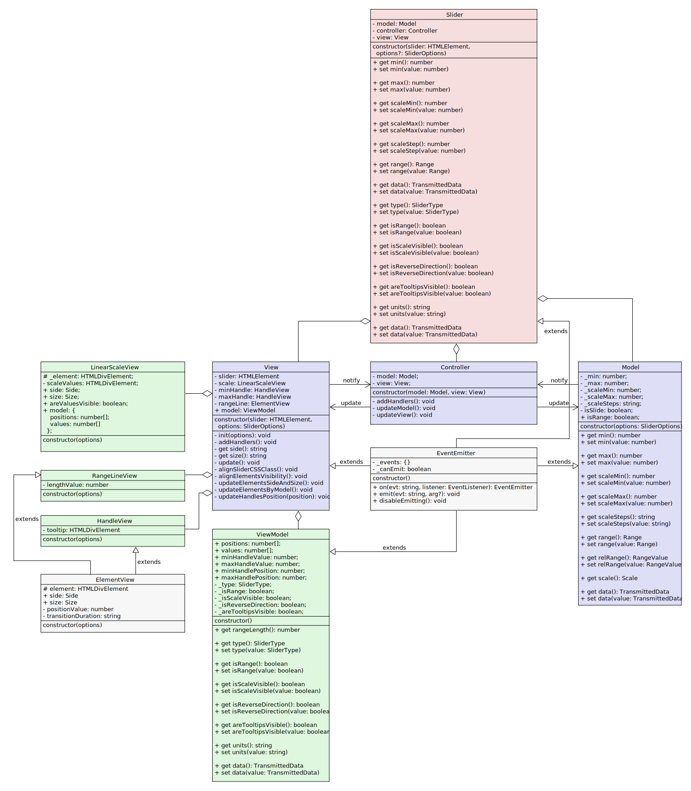

# Range slider

[Demo](https://constantine-p.github.io/FSD-Frontend-4-task/index.html)

Jquery simple range slider
  
## Clone repository
``` 
git clone https://github.com/Constantine-P/FSD-Frontend-4-task.git
```

## Run development server
``` 
npm start
```

## Building
``` 
npm run build
```  

## Testing
``` 
npm t
```  
## Testing with coverage
``` 
npm tc
```  

## Application layers:

  - Model
  - View
    - ViewModel
  - Controller

## Model
  
  1. Содержит, так называемые, бизнес-данные и логику работы с ними, а именно:
     - минимальное и максимальное значение слайдера;
     - минимальное и максимальное значение шкалы слайдера;
     - шаг шкалы (либо последовательность шагов);
  2. Предоставляет интерфейс для работы с данными в виде get / set методов;
  3. Наследуется от класса EventEmitter: позволяет подписываться на собственные изменения;
     
## View

  1. Отвечает за отрисовку слайдера;
  2. Предоставляет публичное свойство model - экземпляр класса ViewModel;
  
### ViewModel
  1. Хранит данные о состоянии представления и логику работы с ними, а именно:
    - положения ползунков;
    - значения подсказок ползунков;
    - массив положений шкалы;
    - массив значений шкалы;
    - тип слайдера (ориентация);
    - диапазон или одно значение;
    - видимость шкалы;
    - видимость подсказок;
    - направление слайдера;
  2. Предоставляет интерфейс для работы с данными в виде get / set методов;
  3. Наследуется от класса EventEmitter: позволяет подписываться на собственные изменения;
   
## Controller
  1. Подписывается на изменения Model, View;
  2. Осуществляет взаимодействие между слоями;
    
## Panel
  1. Отвечает за работу панели управления слайдером;
  2. Предоставляет интерфейс в виде методов get / set data;
        
# Usage
Простой пример:
```html
<div class='slider'></div>
```

``` js
$('.slider').rangeSlider();
```

С опциями:
```html
<div class='slider'></div>
```

``` js
$('.slider').rangeSlider({
  min: 40,
  max: 80,
  scaleMin: 0,
  scaleMax: 100,
  scaleSteps: '20',
  areTooltipsVisible: true,
  isRange: true,
  isScaleVisible: true,
  isReverseDirection: false,
  type: 'horizontal',
});
```

С подключенными панелями:
```html
<div class="slider" id="slider-1"></div>
<div class="panel" id="panel-1">
    <input type="number" class="data-input" step="any" data-js="min">
    <input type="number" class="data-input" step="any" data-js="max">
</div>
<div class="panel" id="panel-2">
    <input type="number" class="data-input" data-js="scaleMin">
    <input type="number" class="data-input" data-js="scaleMax">
    <input type="text" class="data-input" data-js="scaleSteps">
    <input type="number" class="data-input" data-js="min" step="1">
    <input type="number" class="data-input" data-js="max" step="1">
    <select class="data-input" data-js="type">
      <option value="horizontal">horizontal</option>
      <option value="vertical">vertical</option>
    </select>
    <input type="checkbox" class="data-input" data-js="areTooltipsVisible">
    <input type="checkbox" class="data-input" data-js="isScaleVisible">
    <input type="checkbox" class="data-input" data-js="isRange">
    <input type="checkbox" class="data-input" data-js="isReverseDirection">
</div>
```

``` js
const slider1 = $('#slider-1').rangeSlider({
  min: 40,
  max: 80,
  scaleMin: 0,
  scaleMax: 100,
  scaleSteps: '5*10 10*5',
  areTooltipsVisible: true,
  isRange: true,
  isScaleVisible: true,
  isReverseDirection: false,
  type: 'horizontal',
});
new Panel(document.querySelector('#panel-1'), slider1);
new Panel(document.querySelector('#panel-2'), slider1);
```

## Options

| Опции | Тип | По-умолчанию | Описание |
| ------ | ------ | ------ | ------ |
| scaleMin | number | 0 | Минимум шкалы |
| scaleMax | number | 100 | Максимум шкалы |
| scaleStep | string | "10" | Шаг шкалы (либо последовательность шагов). Например: "10", "10 20 30", "3\*10 5\*20 2\*30" |
| min | number | 0 | Минимальное значение |
| max | number | 100 | Максимальное значение |
| type | string | 'horizontal' | Тип ориентации слайдера: 'vertical' или 'horizontal' |
| isRange | boolean | true | Диапазон либо единичное значение |
| isScaleVisible | boolean | true | Отображение значений шкалы |
| areTooltipsVisible | boolean | true | Отображение значений над ползунком |
| isReverseDirection | boolean | false | Обращает направление слайдера (снизу-вверх, слева-направо) |

## Methods
| Метод | Аргумент  | Описание |
| ------ | ------ | ------ |
| get / set scaleMin | number | Минимум шкалы |
| get / set scaleMax | number | Максимум шкалы |
| get / set scaleStep | string | Шаг шкалы (либо последовательность шагов). Например: "10", "10 20 30", "3\*10 5\*20 2\*30" |
| get / set min | number | Минимальное значение |
| get / set max | number | Максимальное значение |
| get / set type | string | Тип ориентации слайдера: 'vertical' или 'horizontal' |
| get / set isRange | boolean | Диапазон либо единичное значение |
| get / set isScaleVisible | true | Отображение значений шкалы |
| get / set areTooltipsVisible | true | Отображение значений над ползунком |
| get / set isReverseDirection | true | Обращает направление слайдера (снизу-вверх, слева-направо) |
| get / set range | { min: number, max: number } | Сразу min и max значения |
| get / set data | { все данные объектом } | Названия полей объекта соответствуют методам выше |

## Events
| Событие | Описание |
| ------ | ------ |
| change | Проосходит, если состояние слайдера меняется |

## UML 


